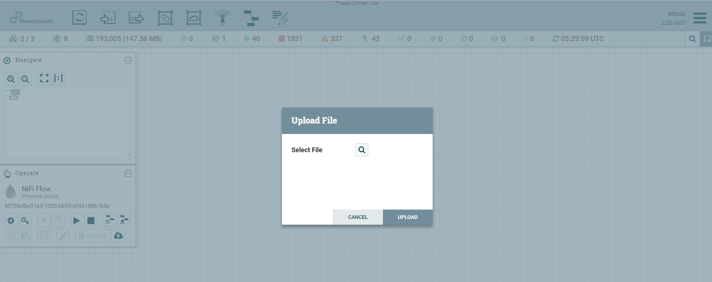
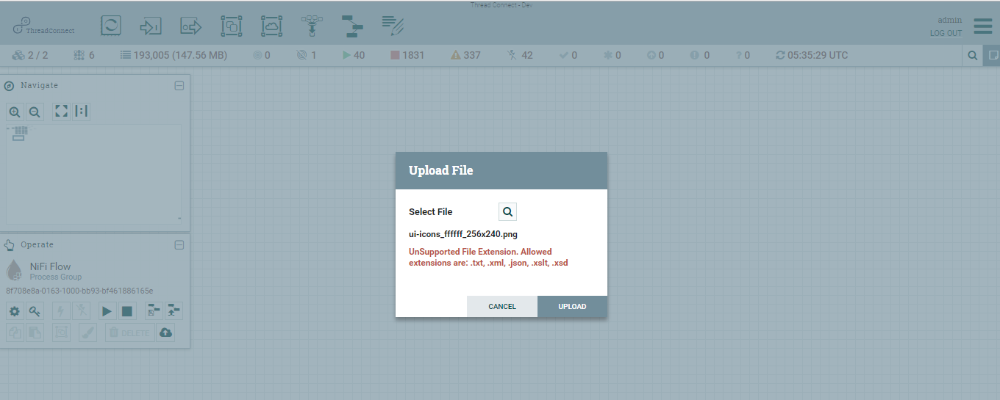
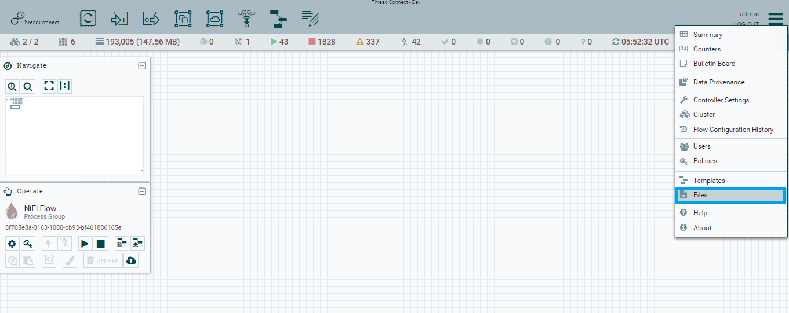
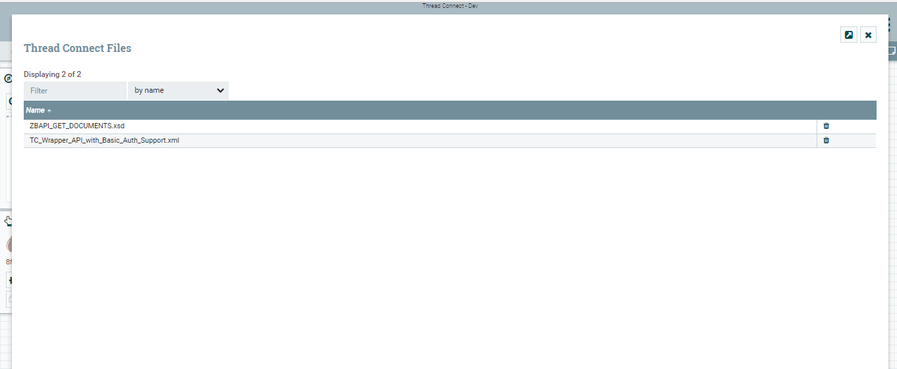
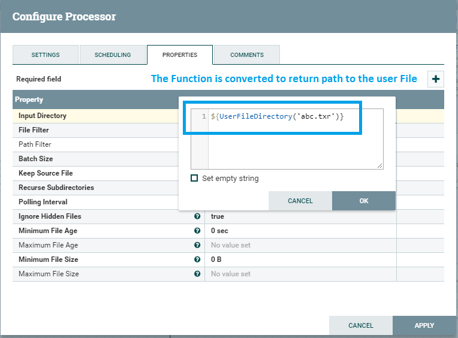

[Back to Home Page](../README.md#welcome-to-thread-connect)

# Thread Connect User Guide

Thread Connect is an extended version of Apache NiFi so to understand how to use Thread Connect, you must know how to use Apache NiFi. Apache NiFi is an extremely robust product and does not come without complexities. Apache NiFi has a very active community of developers and there is a wealth of information on it's use. A list of links to official documentation for NiFi is provided below. Only after understanding that documentation will the full potential of Thread Connect be unlocked. Items that are custom to Thread Connect are documented here as well as information on examples which the Thread Connect team has compiled for common use cases. The examples are a great way to get started with Thread Connect. 

We recommend reading thru the Apache NiFi documentation before starting with Thread Connect and subscribing to the NiFi User Group disribution list if you plan to be seriously using Thread Connect as the majority of questions and issues will be related to technical challenges building data flows. 

### Apache NiFi Resources
- [Apache NiFi Getting Started Guide](https://nifi.apache.org/docs/nifi-docs/html/overview.html)
- [Apache NiFi User Guide](https://nifi.apache.org/docs/nifi-docs/html/user-guide.html)
- [Apache NiFi in Depth](https://nifi.apache.org/docs/nifi-docs/html/nifi-in-depth.html)
- [Apache NiFi Project Site](https://nifi.apache.org/)
- [Apache NiFi Mailing Lists](https://nifi.apache.org/mailing_lists.html)

---

### Thread Connect User Guide Contents
- [Users and Permissions](USER_GUIDE_USER_MANAGEMENT.md#thread-connect-user-guide-contents)
    - [User Management](USER_GUIDE_USER_MANAGEMENT.md#user-management)
    - [User Groups](USER_GUIDE_USER_MANAGEMENT.md#user-groups)
    - [Permissions Management](USER_GUIDE_USER_MANAGEMENT.md#permissions-management)
    - [Policies](USER_GUIDE_USER_MANAGEMENT.md#policies)
- [File Upload Resources](USER_GUIDE_FILE_RESOURCES.md#thread-connect-user-guide-contents)
    - [File Resources](USER_GUIDE_FILE_RESOURCES.md#file-resources)
    - [Referencing File Resources](USER_GUIDE_FILE_RESOURCES.md#referencing-file-resources)
- [Exposing a Web API](USER_GUIDE_EXPOSING_WEB_API.md#thread-connect-user-guide-contents)
- [Setting Up Registry](USER_GUIDE_SETTING_UP_REGISTRY.md#thread-connect-user-guide-contents)
    - [Setting Up Registry](USER_GUIDE_SETTING_UP_REGISTRY.md#setting-up-registry)
    - [Versioning Data Flows](USER_GUIDE_SETTING_UP_REGISTRY.md#versioning-data-flows)
- [Trying Out Examples](USER_GUIDE_TRYING_EXAMPLES.md#trying-out-examples)

---

## File Resources
One of the most powerful features of ThreadConnect is uploading user Files from their local file system to the instance of ThreadConnect. This provides a very simple mechanism for using user Files into Processors/Controller Services. Uploaded Files provide flexibility for users to easily upload Files and avoid the pain of manually placing them.

To upload a File, click the "Upload File"  button in the Operate Palette ( sits to the left-hand side of the screen). This will display the Upload File dialog. 

Click the find icon and use the File Selection dialog to choose which File to upload. Select the file and click Open. Clicking the "Upload" button will attempt to upload the File. File will be uploaded if it belongs to one of the allowed extension types and File should be within threshold size limit

Normally, File of type **JSON**, **TXT**, **XML**, **XSD** and **XSLT** are allowed. File Size is restricted to **10 MB** max. Attempting to upload File beyond file size or unsupported extension will result in error.

Once the File has been successfully uploaded, you can select Files from the Global Menu to open a dialog that displays all of the Files that are currently available to reference into Processors and Controller Services, filter the Files to see only those of interest and delete Files if needed.

[Back to Top](USER_GUIDE_FILE_RESOURCES.md#thread-connect-user-guide-contents)

## Referencing File Resources
Uploaded Files can be picked up from uploaded directory by providing a Function in Expression Language which returns path to the stored file. The Function takes zero or one argument, the argument represents the name of the File you would want to reference. An empty argument will result in all Files being fetch from the uploaded directory. Not all Processor/Controller Service properties support the Expression Language, however. 

To reference a file abc.txt into Processors, wrtie $UserFileDirectory('abc.txt').

[Back to Top](USER_GUIDE_FILE_RESOURCES.md#thread-connect-user-guide-contents)