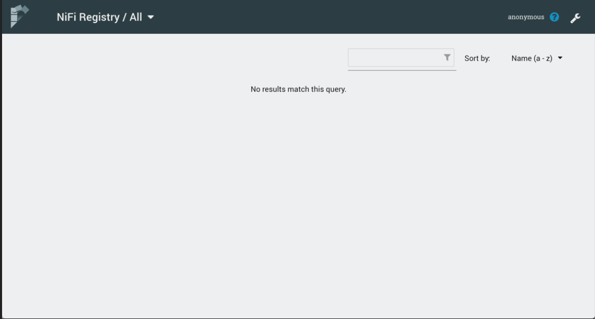
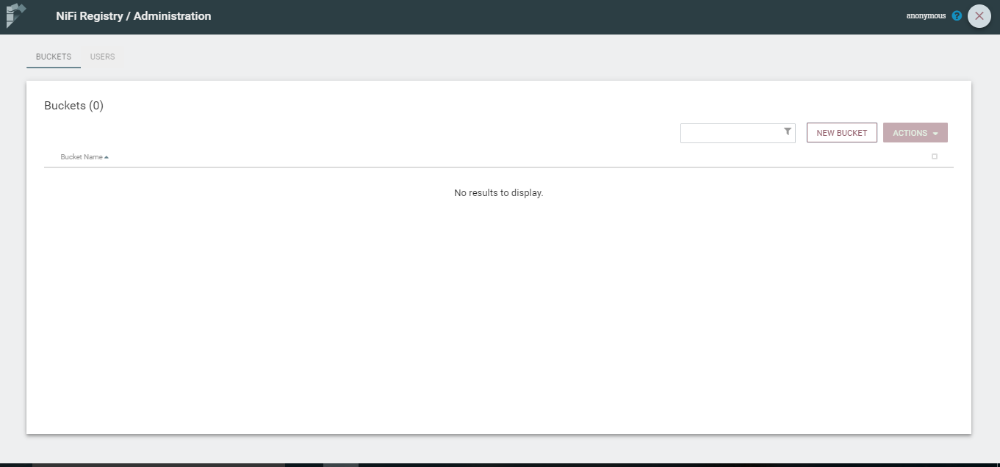
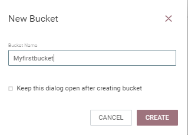
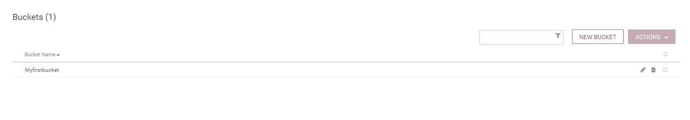
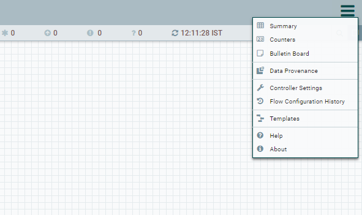
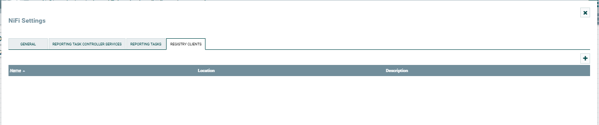
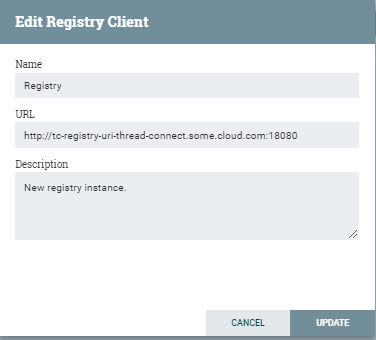
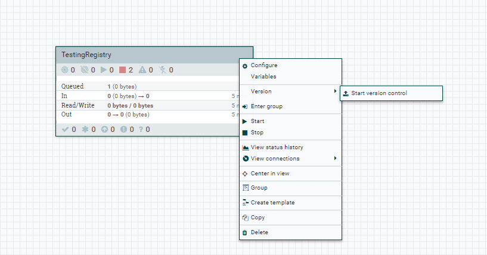
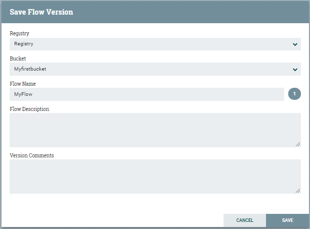
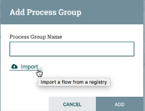

[Back to Home Page](../README.md#welcome-to-thread-connect)

# Thread Connect User Guide

Thread Connect is an extended version of Apache NiFi so to understand how to use Thread Connect, you must know how to use Apache NiFi. Apache NiFi is an extremely robust product and does not come without complexities. Apache NiFi has a very active community of developers and there is a wealth of information on it's use. A list of links to official documentation for NiFi is provided below. Only after understanding that documentation will the full potential of Thread Connect be unlocked. Items that are custom to Thread Connect are documented here as well as information on examples which the Thread Connect team has compiled for common use cases. The examples are a great way to get started with Thread Connect. 

We recommend reading thru the Apache NiFi documentation before starting with Thread Connect and subscribing to the NiFi User Group disribution list if you plan to be seriously using Thread Connect as the majority of questions and issues will be related to technical challenges building data flows. 

### Apache NiFi Resources
- [Apache NiFi Getting Started Guide](https://nifi.apache.org/docs/nifi-docs/html/overview.html)
- [Apache NiFi User Guide](https://nifi.apache.org/docs/nifi-docs/html/user-guide.html)
- [Apache NiFi in Depth](https://nifi.apache.org/docs/nifi-docs/html/nifi-in-depth.html)
- [Apache NiFi Project Site](https://nifi.apache.org/)
- [Apache NiFi Mailing Lists](https://nifi.apache.org/mailing_lists.html)

---

### Thread Connect User Guide Contents
- [Users and Permissions](USER_GUIDE_USER_MANAGEMENT.md#thread-connect-user-guide-contents)
    - [User Management](USER_GUIDE_USER_MANAGEMENT.md#user-management)
    - [User Groups](USER_GUIDE_USER_MANAGEMENT.md#user-groups)
    - [Permissions Management](USER_GUIDE_USER_MANAGEMENT.md#permissions-management)
    - [Policies](USER_GUIDE_USER_MANAGEMENT.md#policies)
- [File Upload Resources](USER_GUIDE_FILE_RESOURCES.md#thread-connect-user-guide-contents)
    - [File Resources](USER_GUIDE_FILE_RESOURCES.md#file-resources)
    - [Referencing File Resources](USER_GUIDE_FILE_RESOURCES.md#referencing-file-resources)
- [Exposing a Web API](USER_GUIDE_EXPOSING_WEB_API.md#thread-connect-user-guide-contents)
- [Setting Up Registry](USER_GUIDE_SETTING_UP_REGISTRY.md#thread-connect-user-guide-contents)
    - [Setting Up Registry](USER_GUIDE_SETTING_UP_REGISTRY.md#setting-up-registry)
    - [Versioning Data Flows](USER_GUIDE_SETTING_UP_REGISTRY.md#versioning-data-flows)
- [Trying Out Examples](USER_GUIDE_TRYING_EXAMPLES.md#trying-out-examples)

---

## Setting Up Registry
When you subscribe for a new Thread Connect service instance, you are also provided with a TC-Registry instance inbuilt with it. This instance is basically an extended Nifi-Registry instance with some additional features. 
Once you successfully create a TC service instance and create a service key to obtain the service instance info, you can access the Registry UI for the service by copying the TC-REGISTRY-UI link from the VCAP output. Paste the URL into the browser bar and you should be directed to the TC-Registry login screen. An example TC-Registry URL is ` https://activate-thread-connect.run.pcs.aws-usw02-dev.ice.predix.io/v1beta/registry/d03922cd-a7ce-4450-8330-aa1ccf2ee495`

The first time you open Registry, it is empty as nothing has been created yet. You can save your data flows that you create in TC and categorize them into buckets. Buckets have to be created from the TC-Registry UI whereas you can save or version control a process group from TC-UI which we'll see later.

To create a new bucket or check existing ones, you can click on the wrench icon on top right corner in TC-Registry UI.

Click on new bucket button, this opens a pop up window where you can fill in name of the bucket that you want to create. Once done, click on `CREATE`. 

Once the bucket is created it will be listed in you buckets list.

To be able to version control your data flows in TC, you need to set up your registry URL in controller settings. To do this, click on the controller settings option from the menu in top right corner of TC-UI.

In the controller settings window that pops up, go to the registry clients tab. Here, all the TC registry instances will be listed. To link your TC-Registry instance provided while subscribing to TC, click on on the plus sign in the top right corner. 

In the Add Registry Client page, enter the name, URL and description of your TC-Registry instance and click on 'ADD'. 

You can now see your TC-Registry URL listed in the Registry Clients tab in controller settings menu.

[Back to Top](USER_GUIDE_SETTING_UP_REGISTRY.md#thread-connect-user-guide-contents)

## Versioning Data Flows
Once you have added you TC-Registry URL as registry client, you can now version your data flows, save them into buckets, manage versions, restore versions and do much more.

- To add flow to a bucket for first time:

 To version a flow, make sure it is in process group. Right click the process group and select `version` and then `Start version control` from menu.

 You'll see a new window open. In this `Save Flow Version` window you can select the bucket to use, name your flow and provide additional details. Click on `SAVE`.

 You'll get a green tick on the process group once your flow is versioned.

- To import a flow from bucket

To import an already version controlled data flow from registry, drag a new process group icon from the toolbar. In the window that pops up, select import option. Select you bucket, flow name and the correct version and click `IMPORT`. You'll see your flow imported on the canvas.

- To commit a new version for a flow:

To commit a new version for an already versioned flow, again right click the process group that has changes. Select `version` and then `Commit local changes`. In the new window, add you message and click `SAVE. A new version for the flow will be created and saved. 

- To revert to a earlier version of a flow:

To revert the flow to am earlier version, right click the process group. Select `Version` and then `Revert version control`. In the new window, select the version you want to revert to and click `SAVE`.
 
- To stop version control for a data flow:

To stop version control for you process group, right click the process group. Select `Version` and then `Stop version control.` 

[Back to Top](USER_GUIDE_SETTING_UP_REGISTRY.md#thread-connect-user-guide-contents)