[Back to Home Page](../README.md#welcome-to-thread-connect)

# Thread Connect User Guide

Thread Connect is an extended version of Apache NiFi so to understand how to use Thread Connect, you must know how to use Apache NiFi. Apache NiFi is an extremely robust product and does not come without complexities. Apache NiFi has a very active community of developers and there is a wealth of information on it's use. A list of links to official documentation for NiFi is provided below. Only after understanding that documentation will the full potential of Thread Connect be unlocked. Items that are custom to Thread Connect are documented here as well as information on examples which the Thread Connect team has compiled for common use cases. The examples are a great way to get started with Thread Connect. 

We recommend reading thru the Apache NiFi documentation before starting with Thread Connect and subscribing to the NiFi User Group disribution list if you plan to be seriously using Thread Connect as the majority of questions and issues will be related to technical challenges building data flows. 

### Apache NiFi Resources
- [Apache NiFi Getting Started Guide](https://nifi.apache.org/docs/nifi-docs/html/overview.html)
- [Apache NiFi User Guide](https://nifi.apache.org/docs/nifi-docs/html/user-guide.html)
- [Apache NiFi in Depth](https://nifi.apache.org/docs/nifi-docs/html/nifi-in-depth.html)
- [Apache NiFi Project Site](https://nifi.apache.org/)
- [Apache NiFi Mailing Lists](https://nifi.apache.org/mailing_lists.html)

---

### Thread Connect User Guide Contents
- [Users and Permissions](USER_GUIDE_USER_MANAGEMENT.md#thread-connect-user-guide-contents)
    - [User Management](USER_GUIDE_USER_MANAGEMENT.md#user-management)
    - [User Groups](USER_GUIDE_USER_MANAGEMENT.md#user-groups)
    - [Permissions Management](USER_GUIDE_USER_MANAGEMENT.md#permissions-management)
    - [Policies](USER_GUIDE_USER_MANAGEMENT.md#policies)
- [File Upload Resources](USER_GUIDE_FILE_RESOURCES.md#thread-connect-user-guide-contents)
    - [File Resources](USER_GUIDE_FILE_RESOURCES.md#file-resources)
    - [Referencing File Resources](USER_GUIDE_FILE_RESOURCES.md#referencing-file-resources)
- [Exposing a Web API](USER_GUIDE_EXPOSING_WEB_API.md#thread-connect-user-guide-contents)
- [Setting Up Registry](USER_GUIDE_SETTING_UP_REGISTRY.md#thread-connect-user-guide-contents)
    - [Setting Up Registry](USER_GUIDE_SETTING_UP_REGISTRY.md#setting-up-registry)
    - [Versioning Data Flows](USER_GUIDE_SETTING_UP_REGISTRY.md#versioning-data-flows)
- [Trying Out Examples](USER_GUIDE_TRYING_EXAMPLES.md#trying-out-examples)

---

## User Management
When first logging into the Canvas for the first time, much of the functionality is disabled by default. To enable all of the functionality needed, Users and Permissions will need to be set up. There are two key concepts with regard to Users and Permissions: Authentication (AuthN) and Authorization (AuthZ). Setting up Users is a two-step process for the time being. Future work is planned to stremline this. There are suggested patterns for setting up Users and Permissions which are suggested in this section. However, what works for one User might not be the best for the next. The key will be to understand how Users and Permissions work within Thread Connect and determine what will work best for your use case. 

As mentioned above, managing users is a two step process. To add a new user to the system, you need to log out first, and then navigate to the `Manage Users` link which is available at the Login Page. 

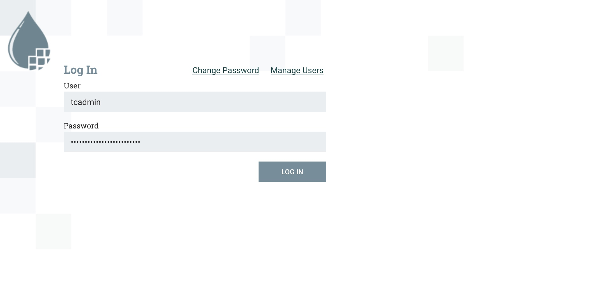

You will be redirected to the Admin Log In screen which will prompt for Admin credentials. The Admin Username and Password provided at service creation time must be used for this process.

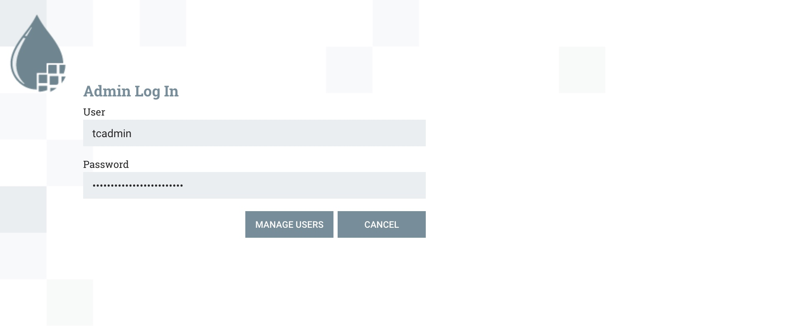

Upon successful login to the Admin Log In page, you will be directed to the Manage Users screen. To add a new User, click on the Add User icon button on the right and provide the details for that user. 

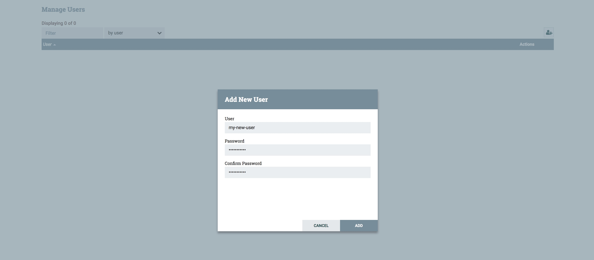
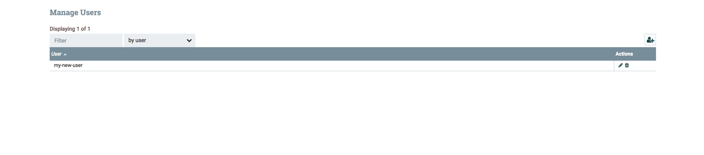

When you are finished adding the user(s), click the done button which will redirect you to main Thread Connect login screen. This is the first step in adding a user. As mentioned above, there are two concepts; authentication and authorization. Users are currently separated by this concept such that you will have to add a user to the authentication module (step 1) and then you will need to add the user to the authorization module (step 2).

After adding the user(s) and being redirected to the regular log in screen, log back in as the admin user. Step 2 in the process will be to add the user(s) via the Global Menu by clicking the Global Menu (hamburger menu) on the top right of the Canvas, and then selecting the Users menu option. 

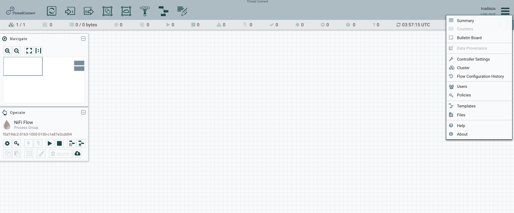

> NOTE: There should be at least 2 users that exist at first. These are system users that should not be modified. Modification of these users will cause the application to become unusable. **Do not edit the Admin user or any users that start with "CN"**

**Below is a screen capture of an example of the users that will be pre-existing that should not be modified:**

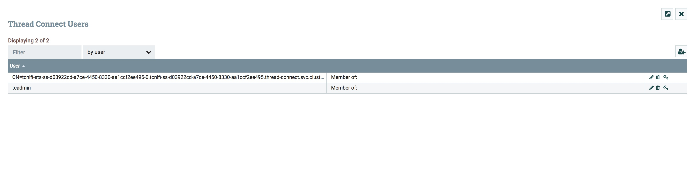

To add the new user(s), click on the add user icon button on the right side of the grid list and enter in the user name as it was entered in step one. The username must match exactly. Click OK when finished adding the username. 

> NOTE: as a best practice and for easier user management, especially when assigning permissions to components, it is best to create User Groups first. Then when adding new users, you will create the new user as described above, but also assign the user to a group at creation time. See the User Groups section for details on creating User Groups. 

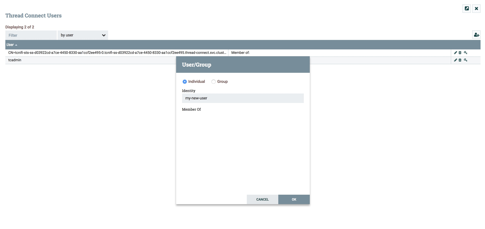

If User Groups have already been created prior to adding the new user, you can assign the new user to a group during user creation. The inverse is the same for when creating user groups. During the creation of a user group, you can assign any existing users to that group at creation time. 

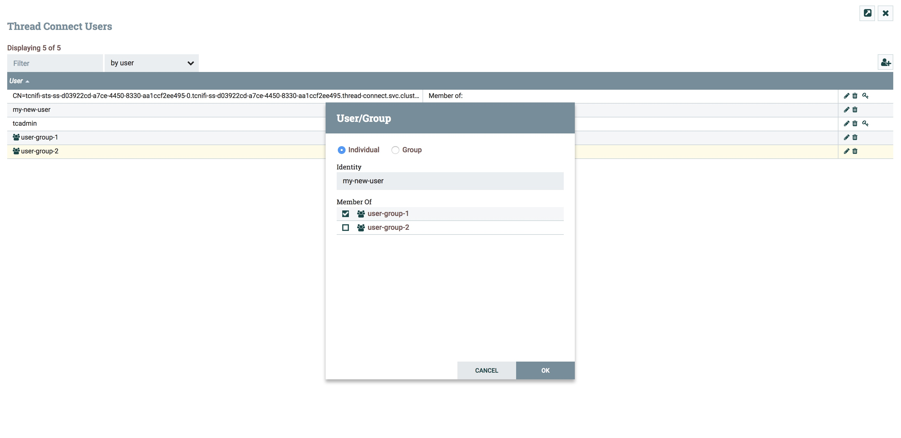

Once the user has been added, permissions (authorization) will need to be added for the user before they are able to view the Canvas. See [Managing Permissions](#managing-permissions) for details. 

[Back to Top](USER_GUIDE_USER_MANAGEMENT.md#thread-connect-user-guide-contents)

## User Groups
User Groups provide a way to group users into logical units for managing permissions. Permissions can be assigned at both the Global Scope and the Component Scope for granular authorization. Example groups that are common are:
- Admin Group
- Developer Group
- ReadOnly Group
- Business-X Group (when co-developing data flows for different engagements that should be segregated)
- Lead Group
- Feature-X Group (same principle as the Business-X Group)

A guiding path for creating groups is to create groups that represent the users that will have access to the system. Are the users that should have full unlimited access? Are there users that should only see certain pieces of the system? Is there development taking place that only specific users should be able to modify? These are some of the questions that should be asked before starting to create users for the system. Try to create at least 2 User Groups that make sense prior to adding users. This will simplify the process of assigning permissions as you move forward with Thread Connect. 

Creating a new User Group is the same as creating a new user, only it doesn't require a two step process. User Groups can be created directly from the Global Menu on the Canvas, under the Users menu option. Click the add new user icon button, type in a name for the user group, and select the Group radio button. You can assign users that have already been created at this time by selecting the users from the list that will be present in the Add User dialog. Select the OK button when you are finished. 

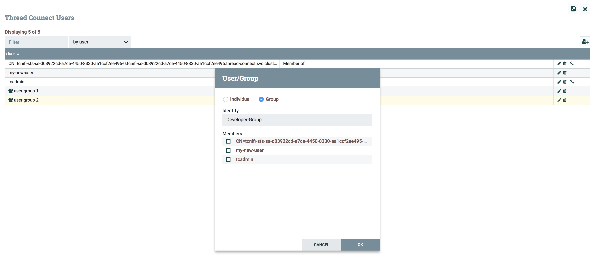

To edit User Groups, select the pencil icon button from the grid that is in line with the User Group you want to edit. Make the needed changes and the select the OK button when finished. 

[Back to Top](USER_GUIDE_USER_MANAGEMENT.md#thread-connect-user-guide-contents)

## Permissions Management
Once Users have been created to log in to the system (authentication), Permissions need to be added to allow the user(s) to perform actions within the system (authorization). This is managed at both the Global Scope as well as the Component Scope. The permissions icon is the little key icon. Wherever you see the little key icon, it is an indicator that permimssions can be configured. When setting up new Users, Permissions need to be configured at the Global Scope to grant permission for the User to "view" the Canvas. These permissions are automatically granted to the Initial Admin User, but any other User that is created will need to have these permissions configured. For additional and in-depth information on Permissions, please see the [Apache NiFi User Guide](https://nifi.apache.org/docs/nifi-docs/html/user-guide.html#UI-with-multi-tenant-authorization) section on Multi-Tenant Authorizations. There you will find detailed information on each of the authorizations that can be granted.

When adding a new User, the new User must be added to the "view the UI" policy at the Global Scope to be able to log in and see the Canvas. If the user does not have permission to "view the UI" they will see an error when logging in, requesting that they contact their system administrator. This is where using User Groups for policy management comes in handy where Permission policies can be set up for User Groups, and then new Users can just be added to the Group to have a standard set of Policies. The tables below list each of the Policies that are available with a description of that policy. 

When first getting started, it is best to do a little testing to fully grasp the Thread Connect Permissions and Policies concept. Below are a couple of examples (screen captures) to show different user view based on the permissions that are set. 

Example:
Users and Groups that are currently set up: Admin-Group and Developer-Group. Each Group has one User. 

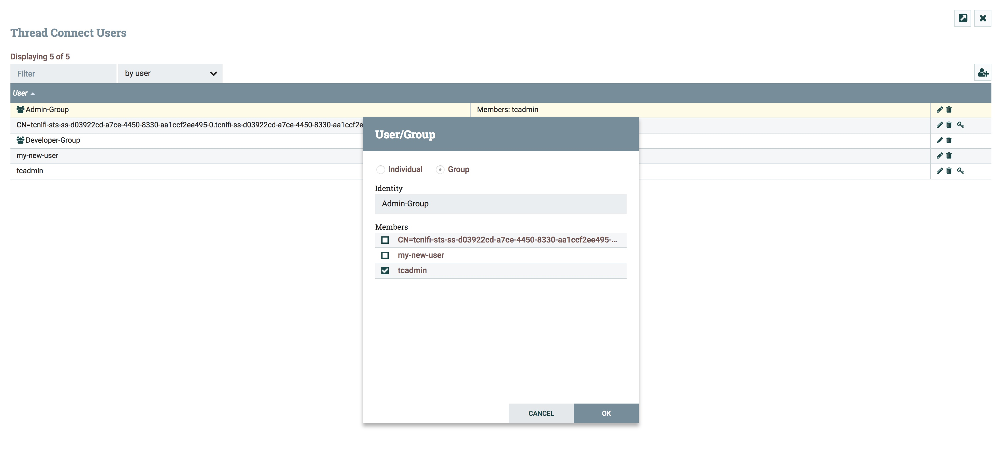
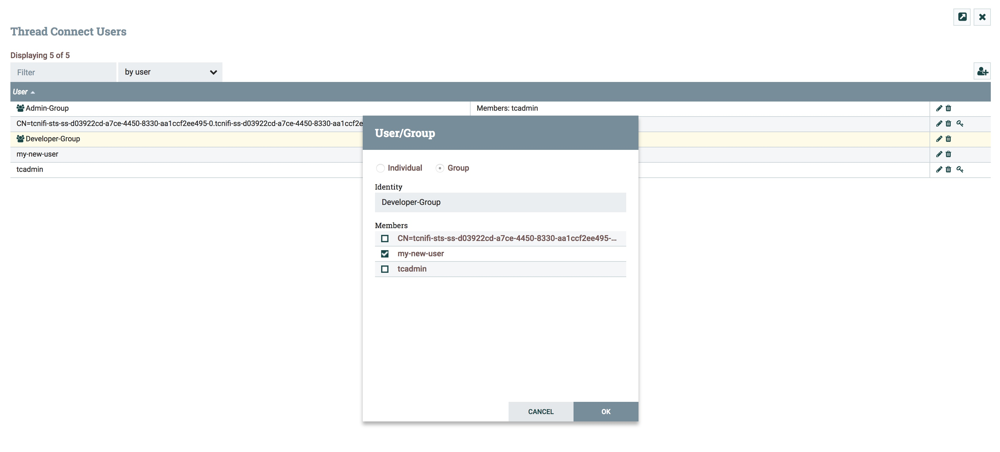

The Currently set Global Scope polices for "view the UI":

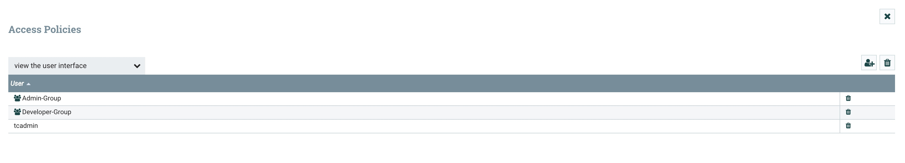

Admin User view of the interface when logged in:

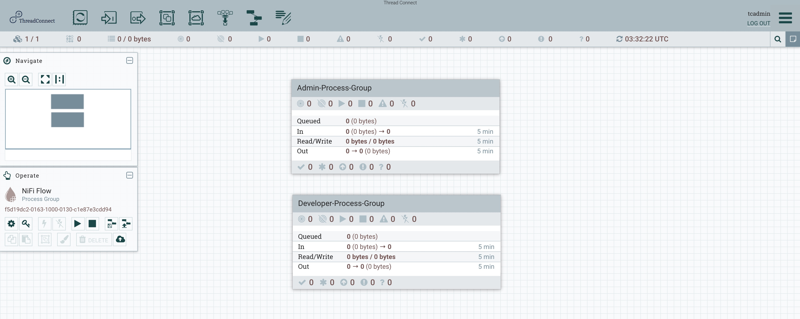

Developer User view of the interface when logged in:

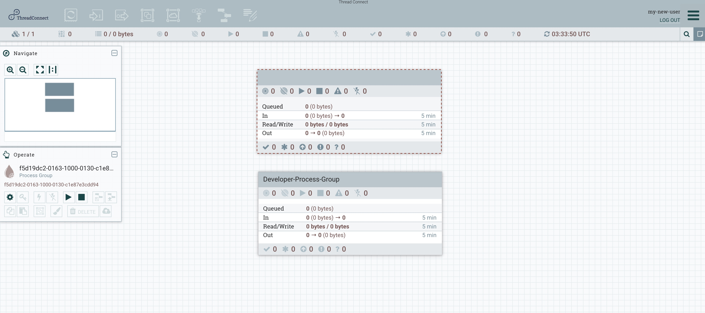

The Currently set Component Level polices for the two process groups on the Canvas:

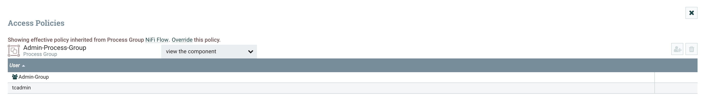
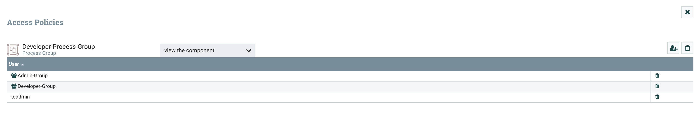

Becuase the Developer-Group only has permissions to see the Developer-Process-Group, any members of the Developer-Group cannot see any of the details of the Admin-Process-Group component. They are able to see that a component is there, but they cannot see any of the details of that process group (or anything within the process group at any depth level). Because the Admin-Group has permissions to both Process Groups, any member of that group has the ability to see any details within both process groups. 

This is only an example of one policy (view the component). The tables below describe each of the policies that are available for both the Global and the Component level scopes. This example should give a glimpse into how policies can be used to manage access within the canvas between users. 

[Back to Top](USER_GUIDE_USER_MANAGEMENT.md#thread-connect-user-guide-contents)

## Policies

### Global Level Policies
Policy | Privilege
-------|----------
view the UI | Allows users to view the UI
access the controller | Allows users to view and modify the controller including reporting tasks, Controller Services, and nodes in the cluster
query provenance | Allows users to submit a provenance search and request even lineage
access restricted components | Allows users to create/modify restricted components assuming other permissions are sufficient. The restricted components may indicate which specific permissions are required. Permissions can be granted for specific restrictions or be granted regardless of restrictions. If permission is granted regardless of restrictions, the user can create/modify all restricted components.
access all policies | Allows users to view and modify the policies for all components
access users/groups | Allows users view and modify the users and user groups
retrieve site-to-site details | Allows other NiFi instances to retrieve Site-To-Site details
view system diagnostics | Allows users to view System Diagnostics
proxy user requests | Allows proxy machines to send requests on the behalf of others
access counters | Allows users to view and modify counters

[Back to Top](USER_GUIDE_USER_MANAGEMENT.md#thread-connect-user-guide-contents)

### Component Level Policies
Policy | Privilege
-------|----------
view the component | Allows users to view component configuration details
modify the component | Allows users to modify component configuration details
view the data | Allows users to view metadata and content for this component through provenance data and flowfile queues in outbound connection
modify the data | Allows users to empty flowfile queues in outbound connections and to submit replays
view the policies | Allows users to view the list of users who can view and modify a component
modify the policies | Allows users to modify the list of users who can view and modify a component
retrieve data via site-to-site | Allows a port to receive data from NiFi instances
send data via site-to-site | Allows a port to send data from NiFi instances

[Back to Top](USER_GUIDE_USER_MANAGEMENT.md#thread-connect-user-guide-contents)