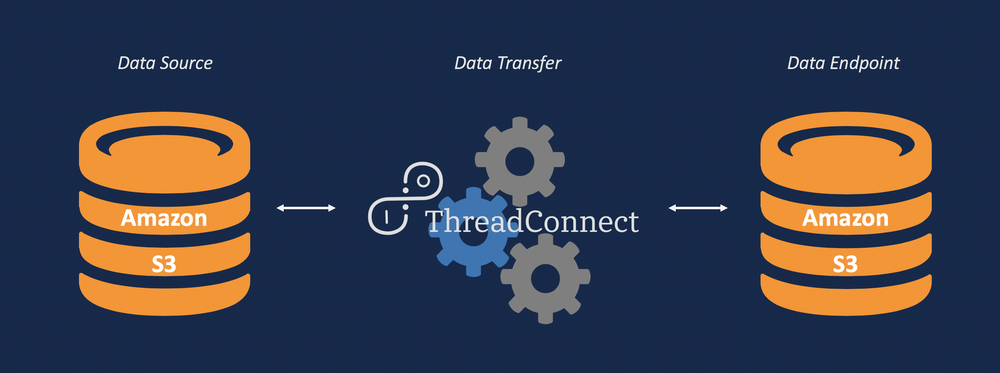
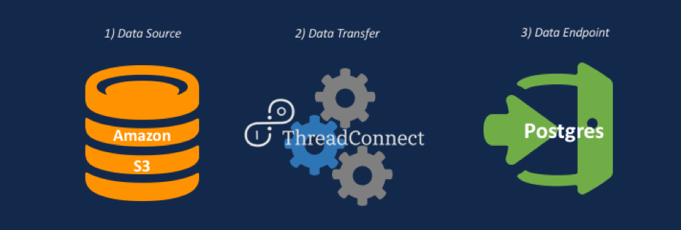

# Amazon S3 Examples
<!-- ------------------------------------------------------ -->

## Invoke Amazon S3 APIs

Invoke an Amazon S3 GET/POST API for buckets

 

#### Key Attributes
* `ListS3`: pulls object list from S3 and creates flow file
* `FetchS3Object`: pulls content from S3 and populates the FlowFile
* `PutS3Object`: uploads each generated flow file to a specified Amazon S3 bucket

#### Developer Notes
* Amazon Simple Storage Service (S3) documentation can be found at: (https://docs.aws.amazon.com/AmazonS3/latest/dev/Welcome.html)

 

<!-- -------------------------------------------------------- -->

## Amazon S3 to Postgres

Read file(s) from S3 bucket/folder; Bulk insert into Postgres staging table

 

#### Key Attributes
* `ListS3`: pulls object list from S3 and creates flow file
* `FetchS3Object`: pulls content from S3 and populates the FlowFile
* `PutDatabaseRecord`: inputs records from flow files into Postgres table

#### Controller Services Created
* `CSVReader`: parses incoming, formatted data
* `AvroSchemaRegistry`: interprets temperature_table in database
* `PostgresCon`: connects to a Postgres database

#### Developer Notes
* _Carefully check that database configuration details are updated across the entire flow when configuring a new database connection._ The `AvroSchemaRegistry` and `PostgresCon` Controller Services hold majority of the Postgres connection details, but many other processors and services require additional information (i.e. database table name). 
* This template utilizes Enterprise Connect (EC).

 
<a href="#top">Back to Top</a>
